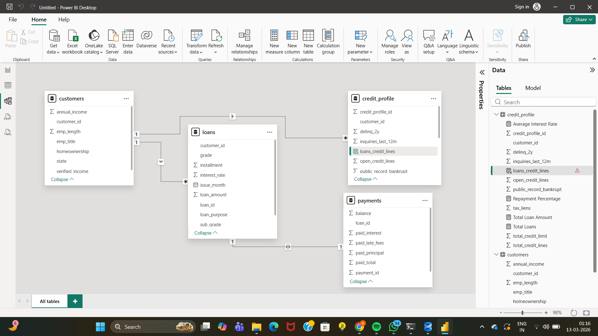
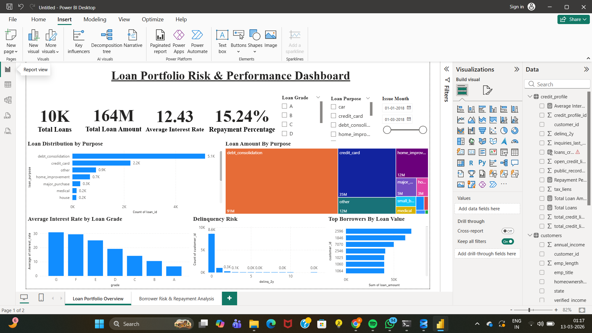
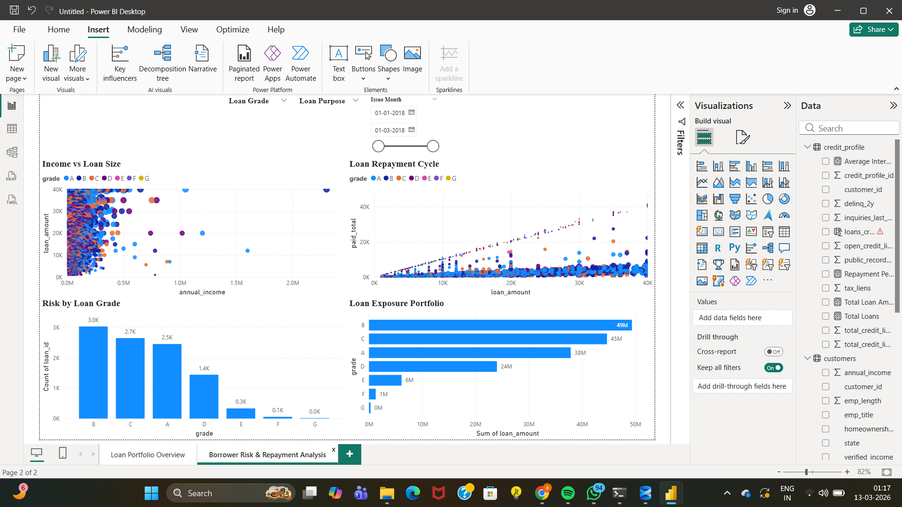

# loan-portfolio-risk-analysis
End-to-end data analysis project exploring loan portfolio risk, borrower behavior, and lending performance using SQL, Python, and Power BI.
# Loan Portfolio Risk & Performance Analysis

This project analyzes a consumer lending dataset to understand borrower behavior, loan distribution, portfolio exposure, and credit risk.

The analysis was performed using **Python, SQL, and Power BI** to create an end-to-end data analytics workflow.

---

# Tools Used

- Python (Data Cleaning & Preparation)
- SQL (Data Analysis)
- Power BI (Data Visualization)
- ER Modeling

---

# Project Workflow

1. Raw lending dataset collected
2. Data cleaned and prepared using Python
3. Structured relational model created
4. Analytical queries written in SQL
5. Interactive dashboard built in Power BI

---

# ER Diagram

This diagram shows the relational structure used for analysis.

---

# Dashboard – Portfolio Overview

This page provides a high level overview of the lending portfolio including loan distribution, interest rates, delinquency risk, and top borrowers.

---

# Dashboard – Risk & Borrower Analysis

This page analyzes borrower behavior, repayment patterns, and portfolio exposure by risk level.

---

# Key Insights

• Debt consolidation loans dominate the portfolio  
• Higher credit grades correspond to lower interest rates  
• Most borrowers have low delinquency risk  
• Portfolio exposure is concentrated in mid-grade borrowers  
• Borrower income has a moderate relationship with loan size  

---

# Project Files

- `data_preparation.ipynb` → Data cleaning using Python  
- `banking_analytics.sql` → SQL analysis queries  
- `Banking_Analytics_dashboard.pbix` → Power BI dashboard  
- `data/` → Dataset files  

---

# Author

**Atishay Jain**  
